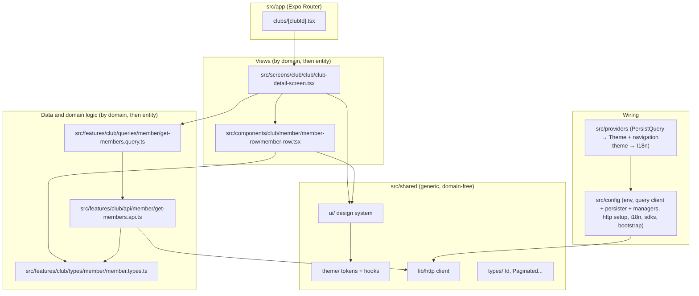
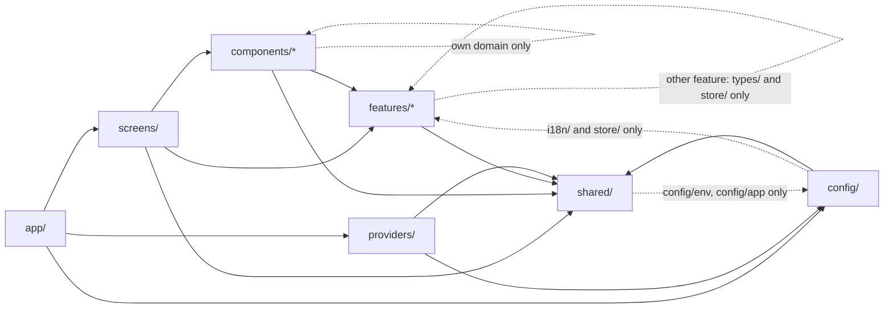
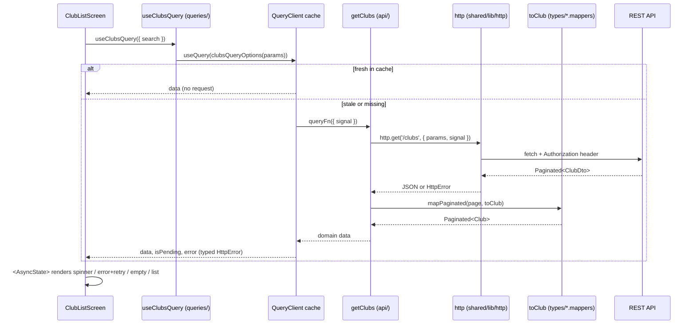
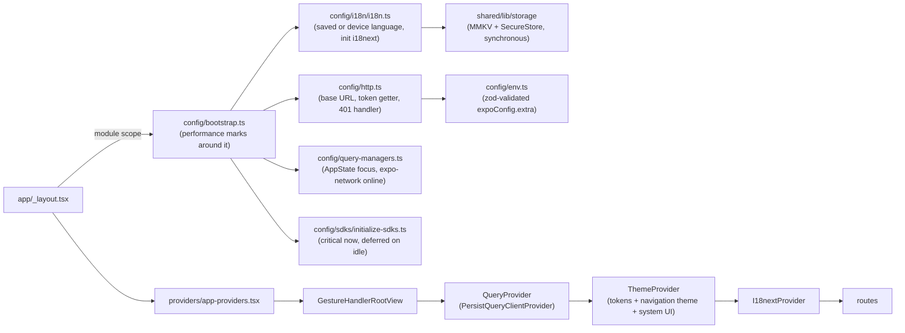
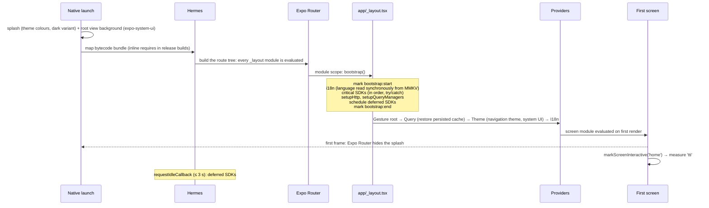
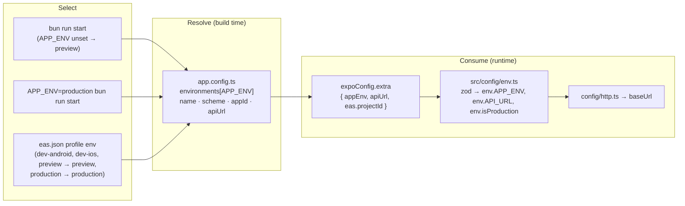

# Expo Native Starter

Expo starter for iOS and Android apps that open fast and feel native, not like a web page in a wrapper.

- **Native first.** New Architecture, Hermes V1, native stack navigation, Material ripple on Android, large titles on iOS, a themed splash and no white flashes in dark mode.
- **Fast by default.** React Compiler on, synchronous storage (MMKV) on the first frame, a persisted query cache, deferred SDK init, inline requires, tree shaking and R8 in release builds.
- **Structure that scales.** Screaming architecture split by domain and entity, explicit `@/` imports, no barrels, and ESLint boundaries that keep it that way.
- **Ready to ship.** Two environments (`preview`, `production`), EAS build and submit profiles, typed i18n in English and Spanish.

The example domain is clubs and their members. Replace it with yours and keep the rules.

## Contents

- [Stack](#stack)
- [Design patterns used and why](#design-patterns-used-and-why)
  - [Architectural](#architectural)
  - [Structural](#structural)
  - [Creational](#creational)
  - [Behavioral](#behavioral)
- [Quick start](#quick-start)
- [Architecture](#architecture)
  - [The big picture](#the-big-picture)
  - [Folder map](#folder-map)
  - [Four principles](#four-principles)
  - [Dependency rules](#dependency-rules)
  - [A domain across three trees](#a-domain-across-three-trees)
  - [Data flow: reading](#data-flow-reading)
  - [Data flow: writing](#data-flow-writing)
  - [Startup and composition root](#startup-and-composition-root)
  - [Design system and theming](#design-system-and-theming)
  - [Internationalization](#internationalization)
- [Performance and native feel](#performance-and-native-feel)
  - [Baseline you get for free](#baseline-you-get-for-free)
  - [React Compiler and memoization](#react-compiler-and-memoization)
  - [Startup path](#startup-path)
  - [Navigation and native feel](#navigation-and-native-feel)
  - [Storage, data and offline](#storage-data-and-offline)
  - [Lists and images](#lists-and-images)
  - [Animations](#animations)
  - [Android release size](#android-release-size)
  - [Opt-in high-performance libraries](#opt-in-high-performance-libraries)
  - [Measuring](#measuring)
  - [Don'ts](#donts)
- [Environments and builds](#environments-and-builds)
- [Scripts](#scripts)
- [AI coding agents](#ai-coding-agents)
- [License](#license)

## Stack

| Concern | Choice | Why |
| --- | --- | --- |
| Runtime | Expo SDK 57, React Native 0.86 (New Architecture, Hermes V1), React 19.2 | Managed native layer, Continuous Native Generation, EAS cloud builds. iOS and Android only |
| Compiler | React Compiler (`experiments.reactCompiler`) | Automatic memoization; no hand-written `useMemo`/`useCallback`/`memo` for performance |
| Navigation | Expo Router (file-based, typed routes, native stack) | Routes are files; deep links and typed `href`s for free; headers themed from our tokens |
| Server state | TanStack Query v5 + opt-in persisted cache | Cache, dedupe, retries, cancellation, stale-while-revalidate, focus and offline aware, instant cold starts |
| Client state | Zustand | Tiny stores for the few things that are not server state |
| Storage | [MMKV v4](https://github.com/mrousavy/react-native-mmkv) (Nitro) + expo-secure-store | Synchronous reads on the first frame; secrets in the keychain / keystore |
| Styling | `StyleSheet` + design tokens + light/dark themes | Zero runtime cost, no class-name DSL, semantic colors, one style object per theme |
| Lists | [Legend List](https://legendapp.com/open-source/list) behind `shared/ui/list` | Pure TypeScript, faster than FlatList and FlashList, dynamic row heights, recycling |
| Images | expo-image behind `shared/ui/image` | Memory + disk cache, transitions, recycling-safe |
| Native feel | expo-splash-screen, expo-system-ui, Reanimated 4 + Worklets, Gesture Handler | No white flashes, native ripple and large titles, UI-thread animations |
| i18n | i18next + react-i18next + expo-localization | Typed translation keys, one namespace per domain |
| Validation | zod | Fail fast on bad config |
| Language | TypeScript strict, `@/` path alias | Explicit imports, no relative paths, no barrels |
| Tooling | bun, ESLint 9 (flat config), EAS CLI, expo-dev-client | Architecture and React Compiler rules enforced by lint |

## Design patterns used and why

Each entry names where the pattern lives in this template, why it is there, and a reference that explains it in depth (most from the [Refactoring Guru catalog](https://refactoring.guru/design-patterns/catalog)).

### Architectural

| Pattern | Where | Why | Learn more |
| --- | --- | --- | --- |
| **Screaming architecture** | `features/`, `components/`, `screens/` split by domain and entity | The tree tells you what the app does, not which framework it uses. | [Uncle Bob: Screaming Architecture](https://blog.cleancoder.com/uncle-bob/2011/09/30/Screaming-Architecture.html) |
| **Vertical slices** | One domain = one folder in each tree | Adding or deleting a domain touches its own folders only; no cross-cutting "controllers" or "models" directories. | [Jimmy Bogard: Vertical Slice Architecture](https://www.jimmybogard.com/vertical-slice-architecture/) |
| **Layered architecture with enforced boundaries** | Dependency rules in `eslint.config.js` | Views depend on data, data depends on shared, nothing depends on views. Lint, not discipline, keeps it that way. | [Martin Fowler: Presentation Domain Data Layering](https://martinfowler.com/bliki/PresentationDomainDataLayering.html) |
| **Composition root** | `config/bootstrap.ts`, `providers/app-providers.tsx` | Everything is wired in one place; the rest of the app receives what it needs instead of building it. | [Mark Seemann: Composition Root](https://blog.ploeh.dk/2011/07/28/CompositionRoot/) |
| **Container / presentational split** | `screens/` (fetch and compose) vs `components/` (render props) | Components stay pure functions of their props; screens own data and navigation. | [patterns.dev: Container/Presentational](https://www.patterns.dev/react/presentational-container-pattern/) |
| **Design tokens** | `shared/theme/tokens`, semantic `theme.colors` | One vocabulary for spacing, color and type; dark mode and rebranding are a token swap. | [Material Design: Design tokens](https://m3.material.io/foundations/design-tokens/overview) |
| **No barrel files** | No `index.ts` under `src/`, lint-enforced | Barrels hide dependencies, defeat tree-shaking and cause circular imports; a full path is self-documenting. | [TkDodo: Please Stop Using Barrel Files](https://tkdodo.eu/blog/please-stop-using-barrel-files) |

### Structural

| Pattern | Where | Why | Learn more |
| --- | --- | --- | --- |
| **Facade** | `shared/lib/http/client.ts` wraps `fetch` (URL building, auth header, JSON, errors) | Features call `http.get('/clubs')` and never see headers, status codes or `AbortController` plumbing. | [Facade](https://refactoring.guru/design-patterns/facade) |
| **Adapter** | `types/<entity>/<entity>.mappers.ts` (`toClub(dto)`), `shared/lib/storage/storage.ts` (MMKV + SecureStore behind `get/set/remove`; `persistStorage` for zustand and TanStack) | The API's wire format and the storage engines' APIs are adapted to the shape the app wants, in one place each. | [Adapter](https://refactoring.guru/design-patterns/adapter) |
| **Data Transfer Object** | `ClubDto`, `MemberDto` in `types/` | The wire shape is explicit and confined to `api/`; the domain type is what the UI consumes. | [Martin Fowler: DTO](https://martinfowler.com/eaaCatalog/dataTransferObject.html) |
| **Gateway** | `features/<domain>/api/` | One function per endpoint is the only code that knows URLs and HTTP verbs. | [Martin Fowler: Gateway](https://martinfowler.com/articles/gateway-pattern.html) |
| **Composite** | Component trees (`ClubCard` → `ClubCardHeader`), screens composing sections | A screen is a tree of small parts that can be rearranged, reused and tested in isolation. | [Composite](https://refactoring.guru/design-patterns/composite) |

### Creational

| Pattern | Where | Why | Learn more |
| --- | --- | --- | --- |
| **Factory Method** | Query key factories (`clubKeys.detail(id)`), `clubsQueryOptions(params)`, `createStyles(theme)` | Callers get a correctly built object without knowing its internals; keys and options stay consistent across hooks, prefetches and mutations. | [Factory Method](https://refactoring.guru/design-patterns/factory-method) |
| **Singleton** | `config/query-client.ts`, `config/i18n/i18n.ts`, the configured `http` client, the MMKV instance in `storage.ts` | One cache, one i18n instance, one HTTP configuration and one storage file per app, created once. | [Singleton](https://refactoring.guru/design-patterns/singleton) |

### Behavioral

| Pattern | Where | Why | Learn more |
| --- | --- | --- | --- |
| **Strategy** | `Storage` contract that routes each key to an engine (MMKV for preferences and cache, SecureStore for keys in `SECRET_KEYS`); `lightTheme` / `darkTheme`; retry policy in `query-client.ts` | Behavior is chosen by swapping an object that satisfies a contract, with no `if` chains in callers. | [Strategy](https://refactoring.guru/design-patterns/strategy) |
| **Observer** | TanStack Query cache subscriptions (`useQuery`), `focusManager` / `onlineManager` fed by `AppState` and expo-network, Zustand selectors, React context | Screens re-render when the data they subscribe to changes, and only then. | [Observer](https://refactoring.guru/design-patterns/observer) |
| **Command** | `mutations/<entity>/<verb>-<entity>.mutation.ts` | A write is an object with `mutate`, pending state, and its own cache side effects, reusable from any component. | [Command](https://refactoring.guru/design-patterns/command) |
| **Stale-while-revalidate** | `staleTime` / `gcTime` defaults in `config/query-client.ts`, persisted cache, `placeholderData` from list caches | Users see cached data instantly, even after a cold start, while a background refetch keeps it fresh. | [TanStack Query: Important defaults](https://tanstack.com/query/latest/docs/framework/react/guides/important-defaults) |
| **Dependency injection via context** | `ThemeContext`, `PersistQueryClientProvider`, `I18nextProvider` | Components ask for the theme, cache or translator instead of importing a global, which keeps them testable. | [React: Passing data deeply with context](https://react.dev/learn/passing-data-deeply-with-context) |

## Quick start

```bash
bun install
bun run start            # Metro dev server, preview environment (default)
bun run ios              # native development build on a simulator (needs Xcode)
bun run android          # native development build on an emulator (needs Android Studio)
bun run typecheck && bun run lint
```

The app uses native modules that Expo Go does not ship (MMKV, Nitro Modules), so it always runs in a development build (`bun run ios|android` locally, or `bun run build:dev:android|ios` on EAS), never in Expo Go.

No `.env` file is required. Copy `.env.example` to `.env` only to change defaults on your machine (see [Environments and builds](#environments-and-builds)).

## Architecture

### The big picture

Three ideas drive the layout:

1. **Routes are thin.** `src/app` contains only Expo Router files that render a screen.
2. **Views and data are separate trees, both split by domain.** `screens/` and `components/` render; `features/` fetches, mutates and types. A view imports a feature, never the other way round.
3. **Everything generic lives once in `shared/`,** and the app is wired together once in `config/` and `providers/`.



### Folder map

```
src/
├── app/            Expo Router routes ONLY. Thin files that re-export a screen.
├── screens/        <domain>/<entity>/<name>-screen.tsx — composition: queries + components.
├── components/     <domain>/<entity>/<component>/ — domain UI (ClubCard, MemberRow).
├── features/       <domain>/<layer>/<entity>/ — api, queries, mutations, types, store, hooks, i18n.
├── shared/         ui/ (design system), theme/, lib/ (http, storage, perf), hooks/, utils/, types/, constants/, i18n/.
├── config/         Composition root: env, app constants, query client, persister, query managers, http setup, i18n init, sdks/, bootstrap.
├── providers/      React providers composed once in app-providers.tsx.
└── types/          Ambient .d.ts (env, i18next, tanstack-query registrations).

app.config.ts       Dynamic Expo config: one entry per environment, selected by APP_ENV. Plugins, React Compiler.
eas.json            EAS Build and Submit profiles (dev-android, dev-ios, preview, production).
metro.config.js     Inline requires for optimized release bundles.
babel.config.js     babel-preset-expo; strips console.log/info/debug from release bundles.
.agents/skills/     Architecture skill for AI coding agents (Codex, Claude Code, ...).
```

### Four principles

| Principle | What it means in practice |
| --- | --- |
| **The tree screams the domain** | `features/club/api/member/invite-member.api.ts` tells you the domain, the layer, the entity and the intent without opening it. |
| **Views and data are separate** | `features/` has no React components. `components/` and `screens/` have no `fetch`. |
| **Small files that grow as a tree** | A component is one `.tsx` under ~100 lines (ESLint fails at 150). It grows by extracting sibling child files, never by scrolling. |
| **Explicit imports, zero duplication** | Every import is `@/path/to/declaring-file`. No `./`, no `index.ts` barrels, no `export *`. Generic code exists once, in `shared/`. |

### Dependency rules

ESLint (`eslint.config.js`) turns these into errors, so a wrong import fails `bun run lint` instead of being a code-review comment.



| From | May import | Never |
| --- | --- | --- |
| `app/` | `@/screens/*`, `@/providers/*`, `@/config/*`, `@/shared/*` | `features/`, `components/` |
| `screens/` | `@/components/*` and `@/features/*` of any domain, `@/shared/*`, `@/config/env`, `@/config/app`, its own domain's screen `.styles` files | `app/`, `providers/`, other screens (`*-screen` files, or anything in another domain's screens) |
| `components/X` | `@/components/X/*` (own domain), `@/features/*`, `@/shared/*`, `@/config/env`, `@/config/app` | `screens/`, other domains' components |
| `features/X` | `@/features/X/*`, other features' `types/*` and `store/*`, `@/shared/*`, `@/config/env`, `@/config/app` | views, other features' api/queries/mutations |
| `shared/` | `@/shared/*`, `@/config/env`, `@/config/app` | everything else |
| `config/` | what it composes, plus `@/features/*/i18n/*` and `@/features/*/store/*` | `app/`, views |

Screens are the only place where domains meet: a home screen may render `ClubCard` and call `useClubsQuery`. A component shared by two domains means its generic part belongs in `shared/ui`.

### A domain across three trees

```
features/club/                        components/club/                     screens/club/
├── api/                              ├── club/                            └── club/
│   ├── club/get-club.api.ts          │   └── club-card/                       ├── club-list-screen.tsx
│   ├── club/get-clubs.api.ts         │       ├── club-card.tsx                ├── club-detail-screen.tsx
│   ├── club/update-club.api.ts       │       ├── club-card-header.tsx         └── club-screens.styles.ts
│   ├── member/get-members.api.ts     │       └── club-card.styles.ts
│   └── member/invite-member.api.ts   └── member/
├── queries/                              ├── club-members-section/
│   ├── club/club.keys.ts                 │   ├── club-members-section.tsx
│   ├── club/get-club.query.ts            │   └── club-members-section.styles.ts
│   ├── club/get-clubs.query.ts           ├── member-row/
│   ├── member/member.keys.ts             │   ├── member-row.tsx
│   ├── member/get-members.query.ts       │   └── member-row.styles.ts
│   └── member/prefetch-club-members.query.ts └── invite-member-button/
│                                                 └── invite-member-button.tsx
├── mutations/
│   ├── club/update-club.mutation.ts
│   └── member/invite-member.mutation.ts
├── types/
│   ├── club/club.types.ts        ClubDto (wire), Club (domain), ClubListParams, UpdateClubInput
│   ├── club/club.mappers.ts      toClub(dto)
│   ├── member/member.types.ts
│   └── member/member.mappers.ts
└── i18n/
    ├── en.json  es.json          keys grouped by entity: club.listTitle, member.invite
    └── resources.ts
```

Every layer is split by entity, so an entity can be found, grown or deleted as a unit in each layer.

### Data flow: reading

Four small files per read, each with one job. The screen never knows there is an HTTP call.



Key choices:

- **`queryOptions()` is the unit of reuse.** The same object feeds `useQuery`, `prefetchQuery`, `setQueryData` and `getQueryData`, fully typed.
- **Hierarchical key factories** (`clubKeys.lists()`, `clubKeys.detail(id)`) let a mutation invalidate "every club list" without knowing which params are in use.
- **Dto vs domain.** The API's naming and nullability stay in `api/` and `types/*.mappers.ts`. Screens and components only ever see the domain type, so an API change touches one mapper.
- **Cancellation.** Every read forwards `signal`, so TanStack Query aborts stale requests.
- **Instant navigation.** The detail query starts from the list's copy (`placeholderData`) and the next screen's data is prefetched on touch down. See [Storage, data and offline](#storage-data-and-offline).

### Data flow: writing

```mermaid
sequenceDiagram
    participant Btn as InviteMemberButton
    participant Mut as useInviteMemberMutation (mutations/)
    participant Api as inviteMember (api/)
    participant QC as QueryClient cache

    Btn->>Mut: mutate({ clubId, email })
    Mut->>Api: inviteMember(input)
    Api-->>Mut: Member (domain)
    Mut->>QC: invalidate memberKeys.list(clubId)
    Mut->>QC: invalidate clubKeys.detail(clubId) (membersCount changed)
    QC-->>Btn: isPending → false; dependent screens refetch
```

The mutation hook owns cache consistency; components call `mutate` and never touch the query client. UI reactions (toast, navigation) go in the component's `mutate(input, { onSuccess })`, so the hook stays reusable.

### Startup and composition root

Everything that needs to happen once lives in `src/config` and runs from the root layout, before any screen mounts.



`GestureHandlerRootView` is outermost because every `GestureDetector` must sit below it (Expo Router's native Stack does not render one). Expo Router's `ExpoRoot` already renders the `SafeAreaProvider` above the root layout, so `app-providers.tsx` does not add a second one. The full startup sequence, from the native splash to the first interactive screen, is in [Startup path](#startup-path).

### Design system and theming

- Components in `shared/ui` (`Screen`, `Text`, `Button`, `AsyncState`, `List`, `Image`) know nothing about the domain and take data through props.
- `List` wraps Legend List with recycling on by default; screens pass `data`, `renderItem`, a stable `keyExtractor` and an `estimatedItemSize`. `FlatList` and direct `@legendapp/list` imports are lint errors outside `shared/ui/list`.
- `Image` wraps expo-image (memory + disk cache, 150 ms transition). `Image` and `ImageBackground` from `react-native` are lint errors.
- Styles are `createStyles = (theme: Theme) => StyleSheet.create(...)` in a sibling `.styles.ts`, consumed with `useStyles(createStyles)`. `useStyles` keeps a module-level cache, so there is one style object per (factory, theme) shared by every instance.
- Only tokens appear in styles: `theme.colors.*` (semantic: `surface`, `textMuted`, `danger`, `ripple`), `theme.spacing.*`, `theme.sizes.*`, `theme.radii.*`, `theme.textVariants.*`, `theme.shadows.*`. A raw hex in a component is a missing token.
- Light and dark themes map the same semantic names to different palette values, so dark mode is free.
- The same tokens reach the native side: `shared/theme/navigation-theme.ts` maps them onto React Navigation's theme (headers, screen background behind transitions), `theme-provider.tsx` sets the native root view colour with expo-system-ui, and the splash colours in `app.config.ts` are the `gray50` / `gray900` tokens. Dark mode has no white header and no white flash.
- Pressables (`Button`, `ClubCard`) use the native Android ripple (`theme.colors.ripple`) with a static style, and a `pressed` style on iOS.

### Internationalization

- One namespace per domain (`features/<domain>/i18n/{en,es}.json`) plus `common` (`shared/i18n`). Keys are grouped by entity (`club.listTitle`, `member.invite`).
- Namespaces are registered once in `config/i18n/resources.ts`; `src/types/i18next.d.ts` types every key, so a typo fails `tsc`.
- Device language is detected with `expo-localization`; dates and numbers go through `Intl` wrappers in `shared/utils/format.ts`.

## Performance and native feel

The template is tuned so that the defaults are fast and feel native on iOS and Android, and so that the next feature does not undo it by accident. This section lists what is already done, where it lives and the rules that keep it that way. Every claim below matches the code and config in this repository; links point at the docs for the installed versions.

### Baseline you get for free

These are SDK 57 / React Native 0.86 defaults. There is nothing to configure, and nothing to turn on.

| What | Why it matters | Where it comes from |
| --- | --- | --- |
| **New Architecture** (Fabric, TurboModules, JSI) | Synchronous native calls, concurrent React features, required by MMKV v4, Reanimated 4 and Nitro | Mandatory since SDK 55; there is no config key any more. [New Architecture](https://docs.expo.dev/guides/new-architecture/) |
| **Hermes V1** with precompiled bytecode | Faster startup, lower memory; release bundles ship as bytecode, not source | `useHermesV1` defaults to `true` in expo-build-properties. [Using Hermes](https://docs.expo.dev/guides/using-hermes/) |
| **Uncompressed, memory-mapped bundle** (Android) | Hermes maps the bytecode file instead of reading and inflating it | `enableBundleCompression` and `useLegacyPackaging` default to `false`; `app.config.ts` leaves them that way on purpose |
| **Precompiled React Native for iOS** | Much shorter native builds (EAS and local) | `buildReactNativeFromSource` defaults to `false`. [build-properties](https://docs.expo.dev/versions/v57.0.0/sdk/build-properties/) |
| **Edge-to-edge** (Android) | Content draws behind the system bars like a native app; safe areas handle the insets | Mandatory; `<Screen>` applies the safe-area edges |
| **120 Hz** on ProMotion iPhones | Animations and scrolling at the display's full refresh rate | The prebuild template sets `CADisableMinimumFrameDurationOnPhone` |

Never edit the generated `android/gradle.properties` or `Info.plist` to change these: `ios/` and `android/` are regenerated by prebuild (Continuous Native Generation). Every native setting goes through `app.config.ts` and config plugins.

### React Compiler and memoization

The [React Compiler](https://react.dev/learn/react-compiler) is **on**: `experiments.reactCompiler: true` in `app.config.ts`. `babel-preset-expo` 57 already bundles `babel-plugin-react-compiler` 1.0.0 and only enables it through that flag, so do not add the Babel plugin yourself ([Expo guide](https://docs.expo.dev/guides/react-compiler/)). The compiler memoizes components, hooks, JSX and derived values automatically, at a finer grain than hand-written memoization.

Rules:

- **Write plain components.** No `useMemo`, `useCallback` or `React.memo` for performance; the compiler does it. There are none in `src/` today.
- **Follow the Rules of React.** The compiler skips (silently) any component or hook it cannot prove safe. ESLint (`eslint-plugin-react-hooks` 7 through `eslint-config-expo`) reports the violations, and this template adds two rules as errors for `src/`: `react-hooks/rule-suppression` (an `eslint-disable` for a hooks rule makes the compiler skip that code) and `react-hooks/void-use-memo` (a `useMemo` whose result is unused).
- **Keep `useMemo` / `useCallback` only as an escape hatch for effect dependencies**, when an effect must not re-run unless a value really changed. The compiler's memoization is an optimization, not a semantic guarantee.
- **Share across instances with module scope, not hooks.** The compiler memoizes per component instance. Values that every instance can share live in a module-level cache: `useStyles` (one style object per factory and theme) and the `Intl` formatters in `shared/utils/format.ts`.
- **`'use no memo'`** as the first statement of a component or file opts it out. Use it only to bisect a suspected compiler bug, with a comment saying why.
- **Zustand selectors that build a new object or array** need `useShallow` from `zustand/react/shallow`; the compiler does not memoize what an external store returns.
- **React 19.2 tools for responsiveness:** `useEffectEvent` for effect callbacks that read the latest props without re-subscribing, `startTransition` / `useTransition` to keep input responsive during expensive updates, and `<Activity mode="hidden">` to keep a hidden subtree's state without rendering it.

How to check that it works:

- `bun run start` prints `React Compiler enabled` when Metro starts.
- React Native DevTools (press `j` in the Metro terminal), Components panel: compiled components show a **Memo ✨** badge.
- An unminified export contains the compiler's cache sentinel: `bunx expo export --platform android --no-bytecode --no-minify` and search `dist/` for `react.memo_cache_sentinel`.

### Startup path



- **Splash and system UI.** The `expo-splash-screen` plugin uses the `gray50` / `gray900` theme tokens as light and dark background colours, and the top-level `backgroundColor` in `app.config.ts` is `gray50`. `ThemeProvider` calls `SystemUI.setBackgroundColorAsync(theme.colors.background)` whenever the scheme changes, so the root view behind transitions and the keyboard matches the theme. expo-system-ui is also what makes `userInterfaceStyle: 'automatic'` work on Android. Expo Router hides the splash itself on the first rendered route, so `preventAutoHideAsync` is not called. [Splash screen](https://docs.expo.dev/versions/v57.0.0/sdk/splash-screen/), [System UI](https://docs.expo.dev/versions/v57.0.0/sdk/system-ui/)
- **What runs before the first frame.** Every `_layout.tsx` module is evaluated when Expo Router builds the route tree; screen modules are evaluated when they first render. Keep layouts thin and keep heavy imports out of them. `bootstrap()` is synchronous and on the critical path; only crash reporting belongs in `criticalInitializers`, everything else goes in `deferredInitializers` (run with `requestIdleCallback`, at most 3 s later; `InteractionManager` is deprecated in RN 0.86). See `src/config/sdks/README.md`.
- **Synchronous storage.** MMKV and SecureStore are read synchronously, so the saved language and the auth token exist on the first render: no loading state, no flash of the wrong language.
- **Optimized release bundles.** `eas.json` sets `EXPO_UNSTABLE_METRO_OPTIMIZE_GRAPH=1` and `EXPO_UNSTABLE_TREE_SHAKING=1` for the `preview` and `production` profiles ([tree shaking](https://docs.expo.dev/guides/tree-shaking/)). With the graph optimized, `metro.config.js` turns on `inlineRequires` for non-dev bundles, so a module is evaluated on first use instead of at startup. Once OTA updates are adopted, every `eas update` must pass the **same flags** (`EXPO_UNSTABLE_METRO_OPTIMIZE_GRAPH=1 EXPO_UNSTABLE_TREE_SHAKING=1 APP_ENV=<env> eas update --channel <env> --environment <env>`): an OTA update must be built exactly like the embedded bundle, or it can behave differently from what was tested.
- **No console in release.** `babel.config.js` strips `console.log`, `.info` and `.debug` from production bundles with `babel-plugin-transform-remove-console` and keeps `error` and `warn`. Hermes builds skip the JS minifier, so `drop_console` in a minifier config would do nothing.
- **Fonts.** The theme uses the system fonts (`textVariants` set no `fontFamily`), which cost nothing at startup. If you add a brand font, embed it at build time with the `expo-font` config plugin instead of loading it with `useFonts` at runtime, which would hold the splash.
- **Updates.** expo-updates is not installed, so there are no `update:*` scripts: without it no build can download an update, and `eas update` would install it on the fly. To adopt OTA, run `bunx expo install expo-updates` and `bunx eas-cli update:configure` (sets `updates.url`), ship a new development and preview build, then add `update:<env>` scripts with the Metro flags above. Keep `updates.fallbackToCacheTimeout` at `0` so a launch never waits for the network; new updates apply on the next launch.

### Navigation and native feel

- **Navigation theme.** `src/shared/theme/navigation-theme.ts` maps our tokens (`primary`, `background`, `surface` → `card`, `text`, `border`, `danger` → `notification`) onto expo-router's `DefaultTheme` / `DarkTheme`, and `theme-provider.tsx` passes it to expo-router's `ThemeProvider`. Native headers and the screen background follow the colour scheme: no white header and no white flash in dark mode.
- **Native stack, frozen when hidden.** The root `<Stack>` sets `freezeOnBlur: true`. On Fabric, screens two or more levels below the top stop re-rendering while hidden; the screen right below the top stays live so the back gesture can show it.
- **Large titles.** The club list uses `headerLargeTitleEnabled` and `headerLargeTitleShadowVisible: false`; `<List>` defaults to `contentInsetAdjustmentBehavior="automatic"`, so the iOS title collapses as the list scrolls. Check on a device that it still collapses after a cold load (the list only mounts once `AsyncState` resolves). If it does not, render the `List` from the first frame and move the loading, error and empty states into `ListEmptyComponent`.
- **Press feedback.** `Button` and `ClubCard` use the native Android ripple (`android_ripple` with `foreground: true` and the `ripple` token) and a static style, so a press never re-renders them. iOS keeps a `pressed` style. `overflow: 'hidden'` (which clips the ripple to the radius) is Android-only, because on iOS overflow plus a shadow costs an extra native view. The ripple is only set when there is an `onPress`.
- **Native tabs.** For a tab bar, prefer `NativeTabs` from `expo-router/unstable-native-tabs`: the platform tab bar (Liquid Glass on iOS 26) instead of a JS one. The API is still marked unstable. [Native tabs](https://docs.expo.dev/router/advanced/native-tabs/)
- **Sheets.** `presentation: 'formSheet'` with `sheetAllowedDetents` gives a native bottom sheet on both platforms without a JS sheet library.
- **Preview and prefetch.** `Link.Preview` shows an iOS peek preview on long press ([Link preview](https://docs.expo.dev/router/reference/link-preview/)). `router.prefetch(href)` mounts a route ahead of navigation; data is prefetched separately (see below).
- **Platform UI.** For native-looking controls, add `@expo/ui` with `bunx expo install @expo/ui`: the root import is the universal set, `@expo/ui/swift-ui` and `@expo/ui/jetpack-compose` are the platform controls ([Expo UI](https://docs.expo.dev/versions/v57.0.0/sdk/ui/)). `expo-glass-effect` (`GlassView`, Liquid Glass with `isLiquidGlassAvailable()` fallback) and `expo-symbols` (`SymbolView`, SF Symbols) follow the same rule: install them explicitly before importing, even though expo-router already pulls them in transitively.
- **Keyboard.** For forms and chat, [react-native-keyboard-controller](https://kirillzyusko.github.io/react-native-keyboard-controller/) gives keyboard-synchronised animations on both platforms ([keyboard handling](https://docs.expo.dev/guides/keyboard-handling/)). It is not installed; it needs a `KeyboardProvider` in `src/providers/` and a new development build.
- **Predictive back is off** (`predictiveBackGestureEnabled: false` in `app.config.ts`): react-native-screens has no predictive-back animations yet, so enabling it would mix the system preview with the classic pop transition.

### Storage, data and offline

- **Storage.** `src/shared/lib/storage/storage.ts` exposes a synchronous `storage.get/set/remove`. Normal keys go to [MMKV v4](https://github.com/mrousavy/react-native-mmkv) (`createMMKV({ id: 'app-storage' })`, memory-mapped, JSI through [Nitro Modules](https://nitro.margelo.com)). Keys in `SECRET_KEYS` (the auth token) go to the keychain / keystore through [expo-secure-store](https://docs.expo.dev/versions/v57.0.0/sdk/securestore/), read once per session and cached in memory. `persistStorage` is the MMKV-only, string-keyed adapter for zustand `persist` and the query persister; never use it for secrets.
- **Persisted query cache, opt-in.** `QueryProvider` is a `PersistQueryClientProvider` writing to MMKV (`config/query-persister.ts`, throttled to once per second, discarded after 24 h or when the app version changes). Only successful queries with `meta: { persist: true }` are written; the clubs list is marked, members (personal data) are not, and paused mutations are never persisted. `gcTime` is 24 h so persisted queries are not garbage-collected first.
- **Focus and online.** `config/query-managers.ts` connects TanStack's `focusManager` to `AppState` (refetch stale data when the app returns to the foreground) and `onlineManager` to `expo-network` (pause while offline, resume on reconnect).
- **Instant detail screens.** `useClubQuery` uses the club from any cached list page as `placeholderData`, so the detail screen paints immediately while the detail request runs. `ClubListScreen` passes `ClubCard` an `onPressIn` that calls the function returned by `usePrefetchClubMembers()`, so the members request starts on touch down, before navigation; the card only forwards the event. Only a pull shows the refresh spinner (local `isPullRefreshing`); background refetches stay silent.

### Lists and images

- **Lists.** Every list is `<List>` (LegendList, recycling on). Give it a stable `keyExtractor` (the id) and a realistic `estimatedItemSize`, keep rows pure functions of their props (`useRecyclingState` for local state), space rows with `contentContainerStyle.gap`, and never nest a vertical list inside a `ScrollView`.
- **Images.** `<Image>` from `@/shared/ui/image/image` wraps [expo-image](https://docs.expo.dev/versions/v57.0.0/sdk/image/) with `cachePolicy="memory-disk"` and a 150 ms transition. In a recycled row, pass `recyclingKey={item.id}` so a reused row never shows the previous image, and a `placeholder` (blurhash, thumbhash or local asset). `prefetchImages(urls)` warms the cache for the next screen. Serve images at the size they are displayed.

### Animations

[Reanimated 4](https://docs.swmansion.com/react-native-reanimated/) (with [Worklets](https://docs.swmansion.com/react-native-worklets/)) and [Gesture Handler](https://docs.swmansion.com/react-native-gesture-handler/) are installed at the SDK 57 versions. `GestureHandlerRootView` already wraps the app in `app-providers.tsx`, so a `GestureDetector` works anywhere in the tree.

- **CSS transitions and animations first.** For state-driven changes (opacity, size, colour), Reanimated 4's `transitionProperty` / `animationName` styles on `Animated.View` are declarative and run on the UI thread.
- **Worklets for gestures and scroll-driven motion.** `useSharedValue`, `useAnimatedStyle` and Gesture Handler's `Gesture` API keep the animation on the UI thread. Read and write shared values with `.get()` and `.set()`, the form Reanimated recommends with the React Compiler, instead of `.value`.
- **Animate transform and opacity**, not layout properties, whenever you can.
- **Static feature flags** (opt-in, native rebuild needed). Reanimated reads `reanimated.staticFeatureFlags` from `package.json`, for example `ANDROID_SYNCHRONOUSLY_UPDATE_UI_PROPS` / `IOS_SYNCHRONOUSLY_UPDATE_UI_PROPS`, which apply non-layout prop updates (transform, opacity, colours) directly on the UI thread. They are off by default, some cannot be combined (the iOS one excludes shared element transitions); turn one on only after measuring a problem it solves.

### Android release size

`expo-build-properties` turns on R8 (`enableMinifyInReleaseBuilds`) and resource shrinking (`enableShrinkResourcesInReleaseBuilds`) for release builds: smaller APK / AAB, less code to load. Libraries ship their own consumer ProGuard rules. If a release build (not a development build) crashes with a missing class, add the keep rule through `extraProguardRules` in the same plugin. Test every change on a `preview` APK. The bundle and native libraries stay uncompressed on purpose (see [Baseline](#baseline-you-get-for-free)): a slightly bigger download in exchange for a faster start.

### Opt-in high-performance libraries

MMKV is the only Margelo library in the template by default. The others are worth adopting when a measurement says you need them, not before.

| Library | What for | Caveats |
| --- | --- | --- |
| [react-native-mmkv](https://github.com/mrousavy/react-native-mmkv) **(installed)** | Synchronous key-value storage | Built on `react-native-nitro-modules`, pinned to exactly `0.37.1` in `package.json` (no `^`): Nitro's native ABI must match every Nitro library, so upgrade it only together with them. Open Nitro issues to watch: [#1652](https://github.com/margelo/nitro/issues/1652) (iOS < 18 crash at launch with `Symbol not found` when built with Xcode 27) and [#1656](https://github.com/margelo/nitro/issues/1656) (Android Hybrid Views get no base ViewProps on RN ≥ 0.86; MMKV has no views, so it is not affected) |
| [react-native-nitro-fetch](https://github.com/margelo/react-native-nitro-fetch) | Faster networking and prefetching requests at app start | Would sit behind `shared/lib/http/client.ts` only. Needs `react-native-worklets` and Nitro ≥ 0.37.1; the same Nitro issues apply |
| [Unistyles v3](https://unistyl.es) | Styles updated in C++ without re-renders on theme or breakpoint changes | Replaces `useStyles` / `createStyles` across the app, adds a Babel plugin and depends on Nitro and Reanimated. A big migration; only for heavy theming or responsive layouts |
| [react-native-release-profiler](https://github.com/margelo/react-native-release-profiler) | Hermes CPU profiles from release builds on real devices | Profiling tool; keep it out of store builds or behind a flag |
| [react-native-keyboard-controller](https://kirillzyusko.github.io/react-native-keyboard-controller/) | Keyboard-synchronised animations and avoiding views | Needs Reanimated (installed) and a `KeyboardProvider` |

Each of these has native code: install with `bunx expo install`, then make a new development build.

### Measuring

Measure on a release build (`preview` APK or ad hoc iOS build) on a mid-range device; development builds are not representative.

| Tool | What it tells you | How |
| --- | --- | --- |
| React Native DevTools | Performance timeline with our marks (`bootstrap:start` / `bootstrap:end`, `screen-interactive:home`, `tti`), React profiler, compiler badges | Press `j` in the Metro terminal. [Docs](https://reactnative.dev/docs/react-native-devtools) |
| `src/shared/lib/perf/startup-metrics.ts` | `markScreenInteractive(name)` measures `tti` from the native start once per process; `observeLongTasks(report)` reports JS tasks over 50 ms where supported | Call `markScreenInteractive` in the first screen's effect (the home screen does). `observeLongTasks` is not wired up; start it from bootstrap and send entries to analytics when needed |
| [Expo Atlas](https://docs.expo.dev/guides/analyzing-bundles/) (on demand) | What is in the bundle and why | Not a dependency: expo-atlas pulls in `stream-json`, which has advisory [GHSA-528h-pc64-c93x](https://github.com/advisories/GHSA-528h-pc64-c93x). Run it only on demand, `EXPO_UNSTABLE_METRO_OPTIMIZE_GRAPH=1 EXPO_UNSTABLE_TREE_SHAKING=1 EXPO_ATLAS=true bunx expo export --platform android` (the CLI offers to install expo-atlas), open with `bunx expo-atlas .expo/atlas.jsonl`, then remove the package and do not commit it |
| `adb shell am start -W` | Android cold start (`TotalTime`) | `adb shell am force-stop com.example.myapp.preview && adb shell am start -W -n com.example.myapp.preview/.MainActivity` on a preview APK; repeat a few times |
| Xcode Instruments, App Launch | iOS launch phases and main-thread work | Profile the release build on a device with the App Launch template |
| [Flashlight](https://github.com/bamlab/flashlight) | Android FPS, CPU and RAM score for a scenario | Run against the preview APK |
| [expo-observe](https://docs.expo.dev/versions/v57.0.0/sdk/observe/) | Real-user startup metrics (TTR, TTI, cold and warm start) sent to EAS Observe or an OpenTelemetry backend | Not installed: `bunx expo install expo-observe` and a new development build |

### Don'ts

- [ ] No `useMemo` / `useCallback` / `React.memo` for performance, and no `eslint-disable` for hooks rules (it turns the compiler off for that code).
- [ ] No `FlatList`, `SectionList` or `Image` from `react-native` (lint errors), and no `ScrollView` + `map` for data that can grow.
- [ ] No async storage on the startup path, and no secret in `persistStorage` or in a query with `meta.persist`.
- [ ] No heavy work or imports in `_layout.tsx` files, and no SDK in `criticalInitializers` unless it observes startup itself.
- [ ] No `InteractionManager` (deprecated); use `requestIdleCallback`.
- [ ] No `refreshing={query.isRefetching}`: it shows a spinner on every background refetch.
- [ ] No raw colours: a hard-coded white background is a white flash in dark mode.
- [ ] No `enableBundleCompression` / `useLegacyPackaging`, and no hand edits to `ios/` or `android/`.
- [ ] No OTA update built with different Metro flags than the build it targets.
- [ ] No upgrade of `react-native-nitro-modules` on its own, and no native dependency without a new development build.
- [ ] No performance claim without a measurement on a release build.

## Environments and builds

The app has two environments, **production** and **preview**, and everything defaults to **preview** (dev server, development builds, preview builds). The whole mapping lives in `app.config.ts`; there is no `app.json`.



| | production | preview (default) |
| --- | --- | --- |
| App name | My App | My App (Preview) |
| Bundle id / package | `com.example.myapp` | `com.example.myapp.preview` |
| Scheme | `myapp://` | `myapp-preview://` |
| API | `https://api.example.com` | `https://api-preview.example.com` |

Both variants install side by side on one device. `EXPO_PUBLIC_API_URL` in `.env` / `.env.local` overrides the API of whatever environment is active (handy for a local backend). Inspect the resolved config with `bun run config` or `bun run config:production`.

### EAS profiles (`eas.json`)

| Profile | Purpose | Android | iOS | Environment |
| --- | --- | --- | --- | --- |
| `dev-android` | Dev client APK to install on a phone or emulator and iterate quickly | APK | — | preview |
| `dev-ios` | Dev client for your registered iPhone | — | device (ad hoc) | preview |
| `preview` | Release build for testers, internal distribution | APK | device (ad hoc) | preview |
| `production` | Store build, auto-incremented build number | App Bundle | App Store | production |

`preview` and `production` also set `EXPO_UNSTABLE_METRO_OPTIMIZE_GRAPH=1` and `EXPO_UNSTABLE_TREE_SHAKING=1` (tree shaking and inline requires, see [Startup path](#startup-path)); the development profiles do not need them.

Submit profiles (`preview` → TestFlight / internal track, `production` → stores) carry placeholder credentials: replace `appleId`, `ascAppId`, `appleTeamId` and drop the Google service-account JSON in `credentials/` (git-ignored).

First time only:

```bash
bun run eas:login                  # or export EXPO_TOKEN in CI
bun run eas:init                   # prints the project id → paste it into app.config.ts (EAS_PROJECT_ID / EAS_OWNER)
bun run eas:device                 # register your iPhone for ad hoc development builds
```

Then:

```bash
bun run build:dev:android          # APK dev client on expo.dev, preview backend
bun run build:dev:ios              # iOS dev client for your registered iPhone
bun run build:local dev-android            # same build on this machine → build/dev-android.apk
bun run build:production:all       # store builds for both platforms
bun run submit:production:ios      # upload the latest production build
```

The iOS Simulator is covered by `bun run ios` (a local development build). Local EAS builds need the native toolchains installed (Xcode, fastlane and CocoaPods for iOS; Android SDK and NDK for Android), build one platform at a time and still need `eas login` for credentials. EAS-hosted environment variables (`eas env:create`) are pulled with `bun run env:pull:preview` / `env:pull:production` into `.env.local`.

### Native dependencies and development builds

Expo Go cannot run this app: it uses native modules that Expo Go does not bundle. Install and use a development build (expo-dev-client) instead. Every time a dependency with native code is added, removed or upgraded, or a config plugin in `app.config.ts` changes, make a **new** development build (`bun run build:dev:android|ios`, or `bun run ios|android` locally); a JS-only reload is not enough. The native dependencies and native config plugins today:

| Package | Why |
| --- | --- |
| `expo-dev-client` | The development build itself (the `dev-*` profiles set `developmentClient`) |
| `react-native-mmkv` + `react-native-nitro-modules` (exact `0.37.1`) | Synchronous storage |
| `expo-secure-store` | Secrets in the keychain / keystore |
| `expo-network` | Online state for TanStack Query |
| `expo-image` | Image component with memory + disk cache |
| `expo-splash-screen`, `expo-system-ui` | Themed splash and root view colour |
| `expo-build-properties` | R8 and resource shrinking in Android release builds |
| `react-native-reanimated`, `react-native-worklets`, `react-native-gesture-handler` | Animations and gestures at the SDK 57 versions |
| `expo-localization`, `expo-router`, `react-native-screens`, `react-native-safe-area-context` | Locale, navigation and native stack |

## Scripts

| Script | What it does |
| --- | --- |
| `start`, `start:production` | Metro dev server for the preview / production environment |
| `ios`, `android` | Build and run a development build locally (`expo run:*`) |
| `lint`, `typecheck`, `doctor` | ESLint (architecture and React Compiler rules included), `tsc --noEmit`, `expo-doctor` |
| `config`, `config:production` | Print the resolved public config |
| `eas:login`, `eas:init`, `eas:device` | One-time EAS setup |
| `env:pull:<env>` | Pull EAS-hosted variables into `.env.local` |
| `build:dev:android`, `build:dev:ios` | Development client builds on EAS (`dev-android`, `dev-ios` profiles) |
| `build:preview:<platform>` | Internal-distribution release builds |
| `build:production:<platform>`, `build:production:all` | Store builds |
| `build:local <profile> [platform]` | Any profile, built on this machine into `build/` (platform inferred for `dev-*`) |
| `build:run:<platform>` | Install the latest EAS build on a simulator / emulator |
| `submit:<profile>:<platform>` | Upload the latest build with the matching submit profile |

## AI coding agents

The architecture is documented for machines as well as people:

- `AGENTS.md` (repository root) is the entry point every agent reads.
- `.agents/skills/app-architecture/` is a vendor-neutral [Agent Skill](https://agentskills.io): `SKILL.md` plus `references/` with the data-layer, component, state and config recipes. Codex discovers `.agents/skills` natively; Claude Code reads the same folder through the symlink in `.claude/skills/`.

An agent that loads the skill knows where every file goes, how it is named, which layers may import which and which shared code already exists, so generated code lands in the right place on the first try.

## License

[MIT](./LICENSE)
